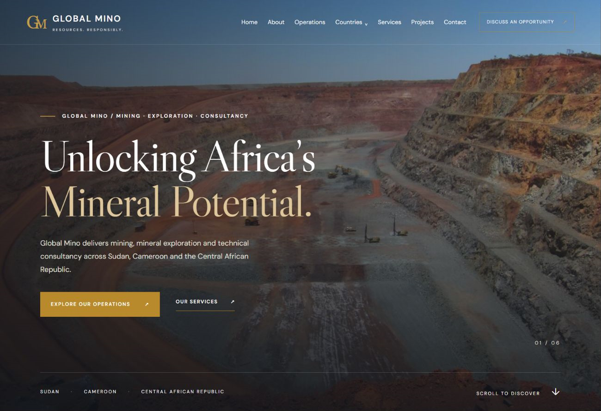

# GLOBAL MINO — Website Design

Homepage design and source assets for the Global Mino mining, exploration and consultancy website.

**[View the live design](https://global-mino-homepage.dmamediai7.chatgpt.site)**



## Preview locally

Requires Node.js. No dependencies to install.

```sh
node server.cjs
```

Open http://127.0.0.1:4173.

## Continue with Claude Code

Read [CLAUDE-HANDOFF.md](CLAUDE-HANDOFF.md) for the complete page structure, design requirements, content restrictions and implementation guidance. The source in `dist/` implements the six-section homepage. Remaining pages are planned, not implemented.

The original brief is in `original-design-brief.txt`. Photo sources and licenses appear in the homepage's Photography credits dialog. Photographs illustrate the design and are not proof of company-owned assets or projects.

The PNG preview shows the hero section; view the live site or run locally to see the entire homepage.
